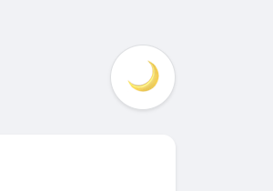
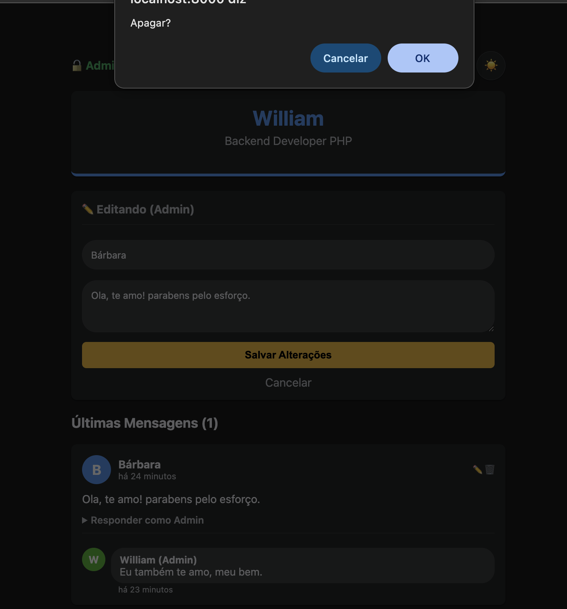
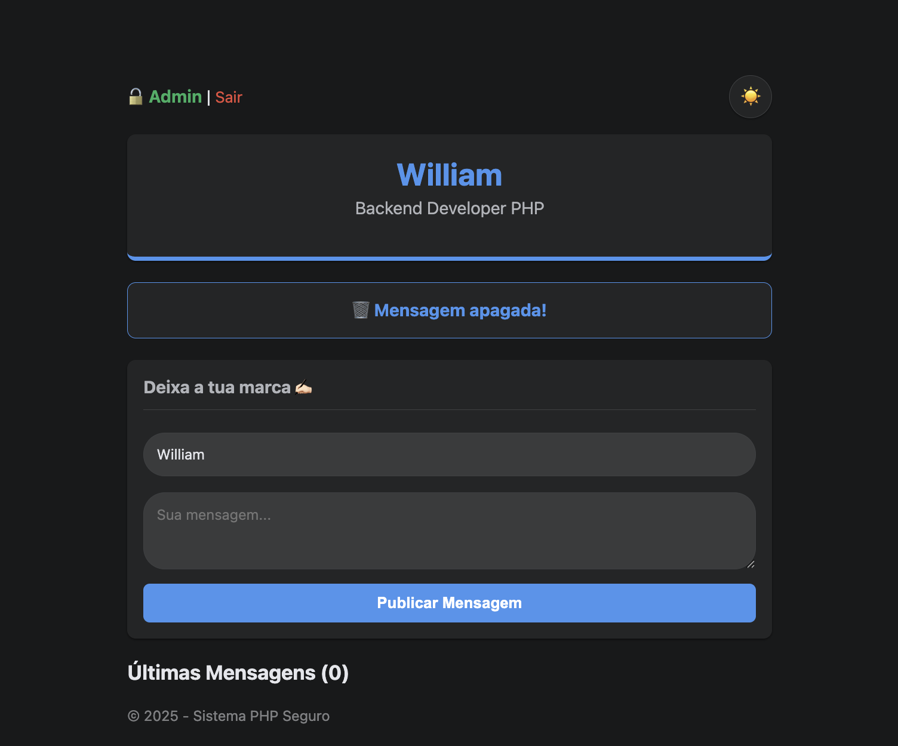
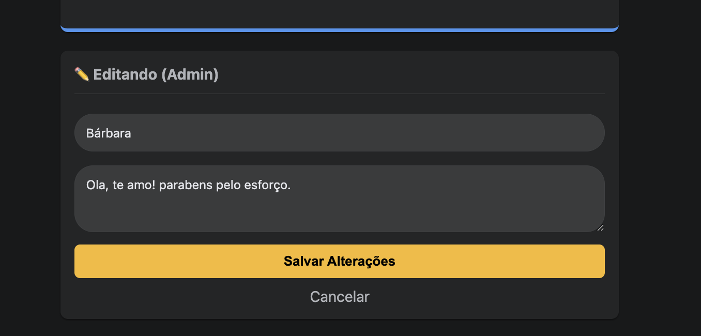
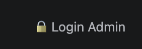
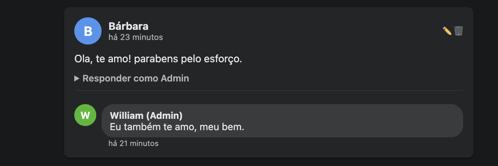
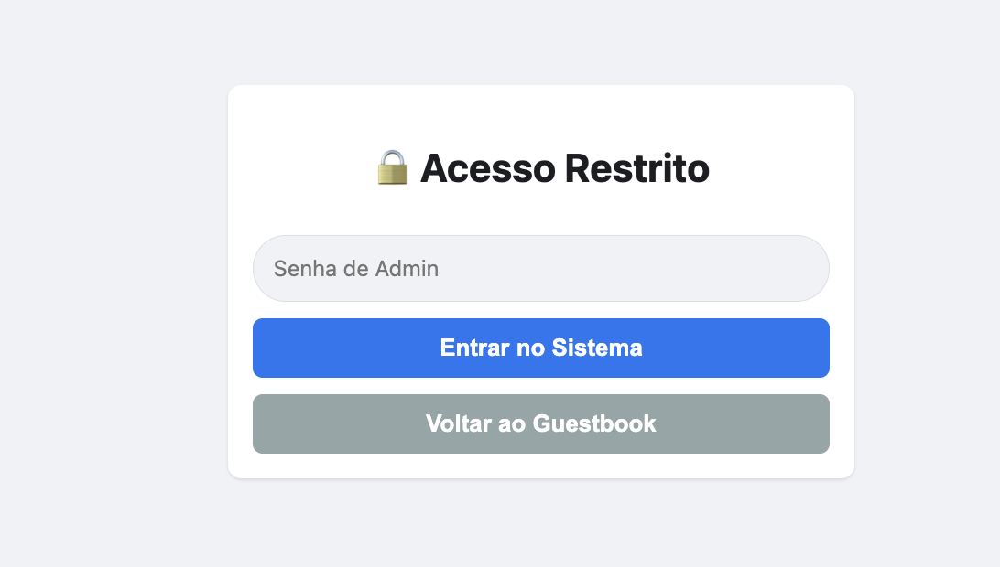
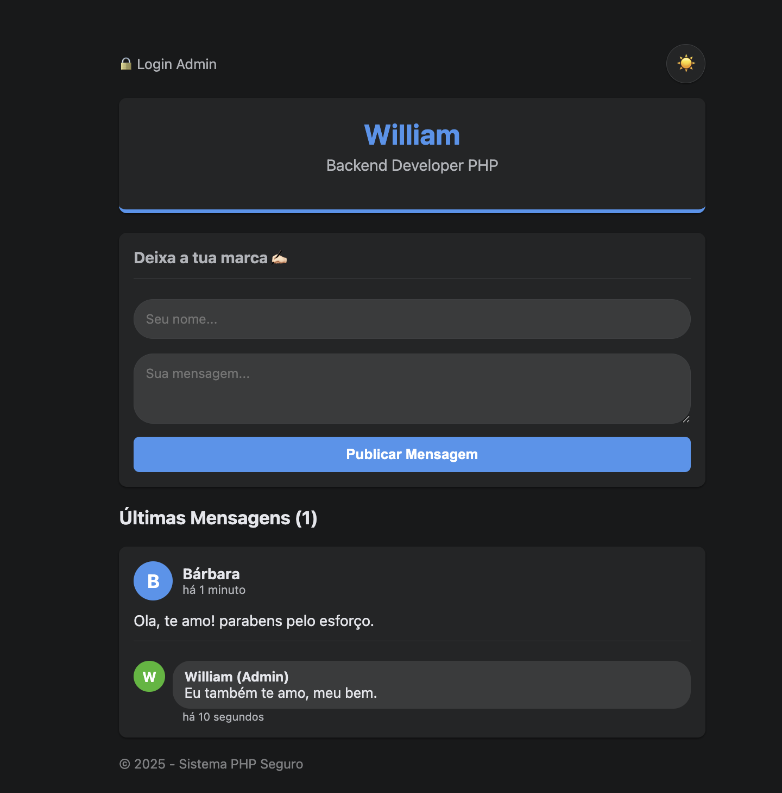

# 📘 Guestbook PHP Modular

Um sistema de livro de visitas (Guestbook) moderno, desenvolvido em PHP 8. O projeto foca em arquitetura limpa (MVC), segurança e experiência do usuário (UX), sem depender de frameworks pesados e utilizando armazenamento via JSON.

  

## 📸 Screenshots

<div style="display: flex; gap: 10px; align-items: center;">
  
  
</div>
<br>
<div style="display: flex; gap: 10px; align-items: center;">
  
  
</div>
<br>
<div style="display: flex; gap: 10px; align-items: center;">
  
  
</div>
<br>
<div style="display: flex; gap: 10px; align-items: center;">
  
  
</div>
<br>
<div style="display: flex; gap: 10px; align-items: center;">
  
  
</div>

## 📺 Demo do Projeto

<video src="https://github.com/user-attachments/assets/9c69f97b-f0fb-4f54-9f60-ea0064a413f3" controls="controls" style="max-width: 100%;">
</video>

## 🚀 Funcionalidades

### 👤 Para o Visitante (Público)

-   **Listagem de Mensagens:** Visualização rápida com datas relativas ("há 5 minutos") usando a biblioteca _Carbon_.
-   **Postagem:** Interface simples para deixar mensagens.
-   **Tema:** Alternância entre **Dark Mode** 🌙 e **Light Mode** ☀️ (persistente via LocalStorage).
-   **Responsividade:** Design adaptável para celulares e desktop.

### 🔐 Para o Administrador (Área Segura)

-   **Autenticação:** Sistema de Login/Logout protegido.
-   **Gestão:** Permissão exclusiva para **Editar** e **Excluir** mensagens.
-   **Respostas:** Sistema de respostas aninhadas (Nested Comments) para interagir com visitantes.
-   **Identidade Visual:** Destaque visual e preenchimento automático para o Admin.

---

## 🛠️ Tecnologias e Arquitetura

O projeto foi refatorado para seguir princípios de **Separação de Preocupações (SoC)**:

-   **Linguagem:** PHP 8+ (Strict Types).
-   **Gerenciador de Dependências:** Composer.
-   **Bibliotecas:** `nesbot/carbon` (Manipulação de datas).
-   **Frontend:** HTML5, CSS3 (com Variáveis CSS), JavaScript Vanilla (separado em módulos).
-   **Armazenamento:** Arquivo JSON (Não requer banco de dados SQL).

### Estrutura de Pastas

```text
/
├── components/      # Fragmentos de HTML reutilizáveis (View)
├── css/             # Estilos com suporte a temas
├── js/              # Lógica de interface (Dark Mode)
├── src/             # Lógica de Negócios (Classe Guestbook)
├── vendor/          # Bibliotecas do Composer
├── index.php        # Controlador Principal
└── mensagens.json   # "Banco de Dados" em arquivo
```

---

## ⚙️ Instalação e Uso

Pré-requisitos: PHP 8+ e Composer instalados.

1. **Clone o repositório:**

    ```bash
    git clone [https://github.com/seu-usuario/php-guestbook.git](https://github.com/seu-usuario/php-guestbook.git)
    cd php-guestbook
    ```

2. **Instale as dependências:**

    ```bash
    composer install
    ```

3. **Configuração de Segurança (Opcional):**
   Por padrão, a senha é `admin123`. Para alterar, crie um arquivo `config.php` na raiz:

    ```php
    <?php
    return [
        'senha_admin' => 'SuaSenhaSeguraAqui'
    ];
    ```

    _(O arquivo config.php já está no .gitignore para segurança)._

4. **Inicie o Servidor:**

    ```bash
    php -S localhost:8000
    ```

5. Acesse `http://localhost:8000` no seu navegador.

---

## 🧠 Aprendizados do Projeto

Este projeto foi essencial para consolidar conceitos de:

-   **CRUD Completo:** Criação, Leitura, Atualização e Exclusão de dados.
-   **Estruturas de Dados:** Manipulação de Arrays aninhados para criar sistemas de respostas (Árvore).
-   **Segurança:** Proteção contra XSS (`htmlspecialchars`), isolamento de arquivos de configuração e validação de sessão.
-   **Composer:** Autoloading e gestão de pacotes externos.

---

## 📝 Licença

Desenvolvido por **William Dias** para fins de estudo e portfólio.
